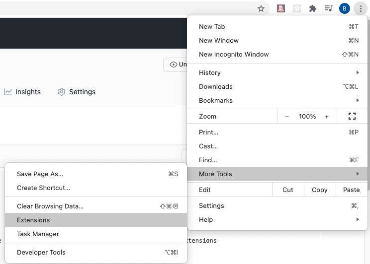

# Gandalf Says

A Chrome extension that sends a notification with a quote every half hour. 
Let your brain breathe! even if only for a few seconds.

### Installation && Usage

Fork the repo and clone to your local drive. In the top-right of your Chrome browser, click the Options menu => More Tools => Extensions

On the extensions page, turn on Developer Mode (top-right of page). This will give you access to new commands.
Click 'Load unpacked' and select this repo.

## Contributions

Would be most welcome! Please decorate your pull request with excessive explanations and thought processes.

### Author

Just lonely ol' me. Please reach out with thoughts, opportunities to help you with projects, or ideas for me to tackle.
My contact info is readily available on my profile.
